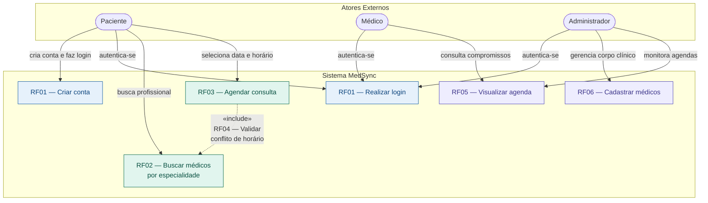
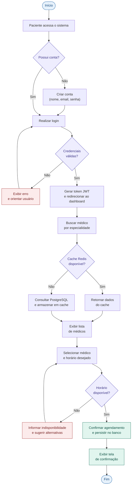
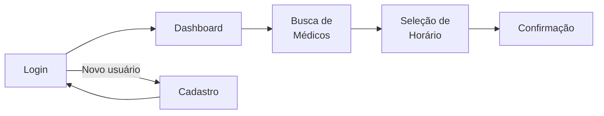
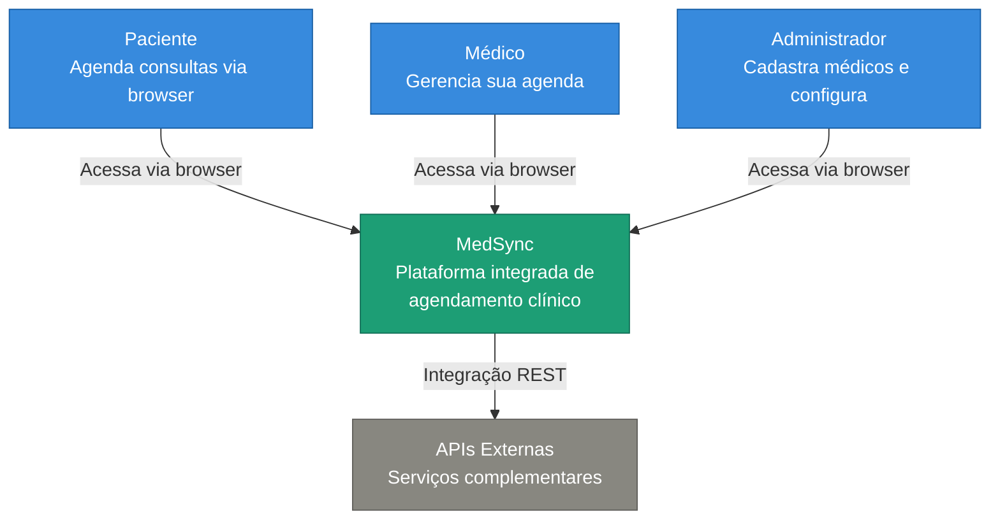
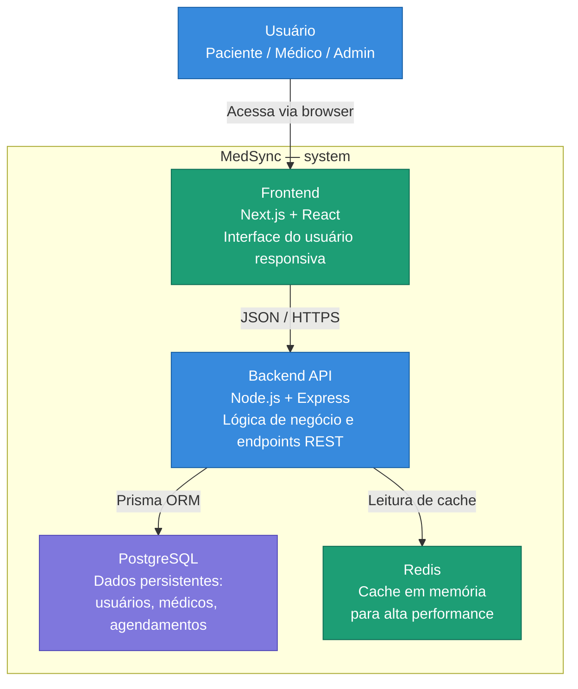
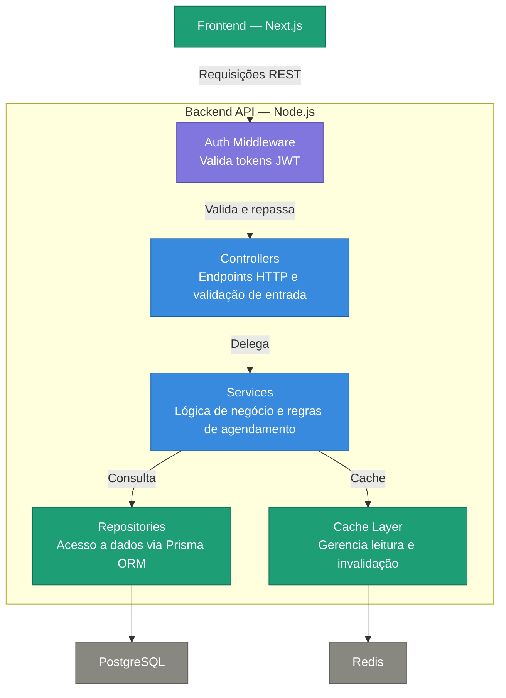
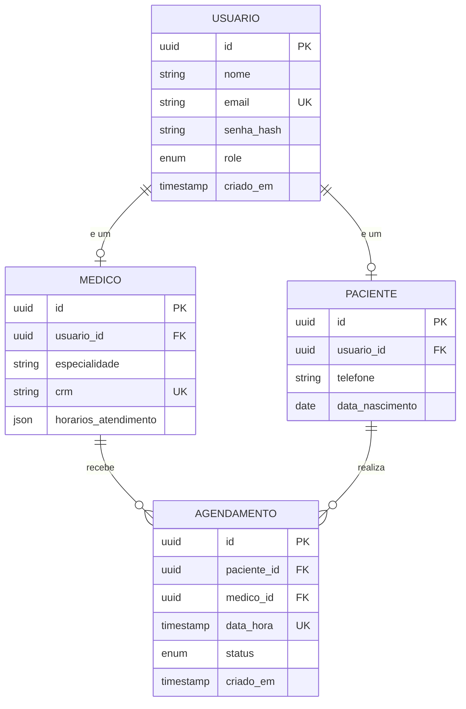
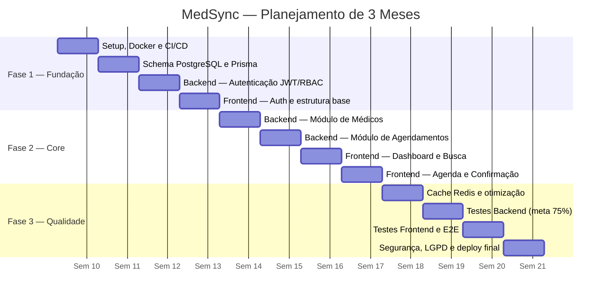

# RFC — Projeto de Portfólio

**Engenharia de Software – Católica SC**

---

# Identificação

- **Título do Projeto:** MedSync — Plataforma Integrada de Agendamento Clínico
- **Linha de Projeto (Direction):** Web / Plataforma / DevOps
- **Autor:** Vitor Bansen Delfino
- **Data da Proposta:** 10/03/2026
- **Versão:** 1.0

---

# 1. Visão do Produto e Impacto (O Problema)

O objetivo desta seção é responder uma pergunta fundamental: este projeto resolve um problema real ou é apenas um exercício técnico? Conforme demonstrado a seguir, o MedSync nasce de uma demanda concreta identificada em clínicas de médio porte, onde processos de agendamento ineficientes causam prejuízos financeiros e operacionais diários.

---

## 1.1 Contexto e Problema

O processo de agendamento de consultas médicas em clínicas de médio porte ainda é, em grande parte, dependente de métodos manuais ou de sistemas isolados e pouco integrados entre si. Essa realidade gera uma série de problemas operacionais que afetam tanto os profissionais de saúde quanto os pacientes. Conflitos de agenda ocorrem com frequência quando múltiplos atendentes tentam coordenar horários sem uma visão unificada da disponibilidade dos médicos. O índice de absenteísmo (no-show) permanece elevado, uma vez que não há mecanismos eficientes de lembrete ou confirmação automatizada.

Do ponto de vista do paciente, a experiência também deixa a desejar. A necessidade de ligar para a clínica durante o horário comercial, aguardar em filas telefônicas e depender de anotações manuais reduz significativamente a acessibilidade ao serviço de saúde. Para os gestores, a ausência de dados consolidados dificulta a tomada de decisões estratégicas, como a alocação de horários, o dimensionamento da equipe médica e o acompanhamento de indicadores de desempenho. Atualmente, a maioria dos agendamentos é realizada por telefone ou por planilhas e sistemas legados que não se comunicam entre si, resultando em retrabalho e baixa eficiência operacional.

---

## 1.2 Origem da Demanda e Evidências

A demanda pelo MedSync foi validada por meio de uma pesquisa qualitativa realizada com 10 usuários entre pacientes e profissionais de saúde, além da análise de processos em clínicas de médio porte localizadas na região de Joinville/SC. As entrevistas foram conduzidas de forma semiestruturada em 10 de abril de 2026 e revelaram padrões consistentes de insatisfação com os métodos atuais de agendamento.

### Entrevistas Realizadas

As quatro entrevistas a seguir foram conduzidas em 10/04/2026. As três primeiras ocorreram presencialmente em uma clínica de biomedicina de médio porte em Joinville/SC. A quarta foi realizada remotamente com um profissional de TI de uma software house da mesma região. O roteiro abordou organização de agenda, índice de no-show, processo de agendamento atual e abertura para adoção de uma solução digital.

---

#### Entrevista 1 — Dra. Lívia Andrade
**Perfil:** Biomédica, responsável técnica da clínica. Coordena a agenda de 5 profissionais e responde pela gestão operacional do espaço.
**Data:** 10/04/2026

A Dra. Lívia relatou que o controle de agenda da clínica é feito por meio de uma planilha compartilhada no Google Sheets, sem nenhuma trava de concorrência. Como múltiplas pessoas editam o documento ao mesmo tempo, conflitos de horário ocorrem com frequência, especialmente nos períodos de maior demanda.

> "A planilha funciona até um certo ponto, mas quando duas atendentes marcam ao mesmo tempo sem avisar uma a outra, o paciente chega e descobre que tem outra pessoa no mesmo horário. Já aconteceu mais de uma vez na mesma semana."

Ao ser questionada sobre absenteísmo, a Dra. Lívia estimou que entre 20% e 30% das consultas agendadas resultam em no-show. A clínica não possui nenhum mecanismo automatizado de lembrete, e as confirmações são feitas manualmente por telefone quando a agenda do dia seguinte permite.

> "A gente tenta ligar para confirmar, mas nem sempre tem tempo. Quando não confirma, a chance de o paciente não aparecer é muito alta. Cada falta é dinheiro perdido e um horário que poderia ter sido ocupado."

Sobre a adoção de uma nova solução, demonstrou interesse claro, com a condição de que o sistema centralizasse a agenda de todos os profissionais em uma única interface e eliminasse a dependência da planilha.

> "O que eu preciso é de uma tela onde eu veja todo mundo de uma vez. Hoje eu tenho que olhar aba por aba na planilha para saber se tem horário disponível."

**Principais dores identificadas:** conflito de horários na planilha compartilhada, absenteísmo elevado, ausência de lembretes automáticos, falta de visão unificada da agenda.

---

#### Entrevista 2 — Rebeca Biondi
**Perfil:** Biomédica, atua na clínica há 3 anos realizando coletas e procedimentos estéticos.
**Data:** 10/04/2026

Rebeca descreveu sua frustração com a falta de autonomia para gerenciar sua própria agenda. Por não ter acesso a um sistema dedicado, ela depende das atendentes para saber o que tem marcado no dia seguinte, o que frequentemente gera falhas de comunicação.

> "Às vezes chego cedo para um procedimento que exige preparo e descubro que o paciente cancelou na véspera, mas ninguém me avisou. Fico sabendo quando ele não aparece. Isso é muito desgastante."

Rebeca relatou também que a ausência de um histórico acessível de agendamentos dificulta seu trabalho clínico, pois ela não consegue verificar com facilidade quantas sessões um paciente já realizou ou qual foi o intervalo entre os procedimentos.

> "Para saber o histórico de um paciente eu preciso pedir para a recepção procurar na planilha. Isso interrompe o atendimento e ainda depende de alguém ter registrado corretamente na época."

Ao ser questionada sobre uma plataforma com acesso por perfil de profissional, reagiu positivamente, destacando que o mais importante seria receber notificações automáticas sobre cancelamentos e novos agendamentos vinculados à sua agenda.

**Principais dores identificadas:** falta de autonomia sobre a própria agenda, ausência de notificações de cancelamento, dificuldade de acesso ao histórico de pacientes, dependência da recepção para informações básicas.

---

#### Entrevista 3 — Julia Viertel
**Perfil:** Biomédica esteta, realiza procedimentos de estética avançada na clínica. Tem perfil mais técnico e já utilizou outras ferramentas de gestão em empregos anteriores.
**Data:** 10/04/2026

Julia trouxe uma perspectiva comparativa, tendo trabalhado anteriormente em uma clínica que utilizava um sistema de agendamento online. Ela destacou que a diferença de organização entre os dois ambientes é evidente e que sente falta de recursos que considera básicos, como a confirmação automática de consultas e o bloqueio de horários para procedimentos que exigem mais tempo.

> "No lugar onde eu trabalhava antes, o sistema bloqueava automaticamente o tempo certo para cada tipo de procedimento. Aqui, se a recepção marcar uma harmonização num slot de 30 minutos sendo que precisa de 1 hora e meia, o resto do dia vai por água abaixo."

Ela relatou ainda que a ausência de controle de duração por tipo de procedimento gera atrasos que se acumulam ao longo do dia e impactam diretamente a experiência do paciente.

> "Paciente que espera 40 minutos além do horário marcado não volta. E aí a culpa cai sobre a profissional, mas o problema é o agendamento mal feito desde o início."

Julia também mencionou a dificuldade de bloquear horários para treinamentos ou ausências sem que a recepção acidentalmente marque pacientes nesses períodos.

**Principais dores identificadas:** ausência de controle de duração por tipo de procedimento, acúmulo de atrasos, impossibilidade de bloquear horários de forma confiável, impacto direto na experiência do paciente.

---

#### Entrevista 4 — Vitor Monteiro
**Perfil:** Analista de TI em software house de Joinville/SC, com experiência em desenvolvimento e implantação de sistemas para o setor de saúde.
**Data:** 10/04/2026 (remota)

Vitor foi entrevistado para trazer a perspectiva técnica do mercado de soluções para clínicas. Ele relatou que atende diversas clínicas de pequeno e médio porte como cliente e que o cenário de sistemas legados é a realidade da grande maioria.

> "A maior parte das clínicas que eu atendo ainda usa sistema desktop instalado localmente, sem nenhuma sincronização em nuvem. Quando o computador da recepção dá problema, a agenda some. Já vi clínica perder meses de histórico por falta de backup."

Vitor descreveu as principais barreiras que encontra ao tentar convencer clínicas a migrarem para soluções modernas: custo elevado das plataformas consolidadas, resistência da equipe ao aprendizado de novos sistemas e a falta de APIs abertas que permitam integração com outros softwares já utilizados.

> "O iClinic é completo, mas o preço trava na hora. A clínica de médio porte não tem orçamento para pagar o que eles cobram por usuário. Aí ficam na planilha, que é de graça mas custa caro em retrabalho."

Sobre o que consideraria indispensável em uma nova solução voltada para esse segmento, Vitor listou: arquitetura baseada em nuvem com backup automático, acesso via navegador sem instalação local, controle de acesso por perfil de usuário e API documentada para integrações futuras.

> "Se tiver API REST bem documentada, eu consigo conectar com qualquer sistema de prontuário ou financeiro que o cliente já use. Isso é o que diferencia uma ferramenta que a clínica vai usar por anos de uma que vai ser abandonada em seis meses."

**Principais dores identificadas:** sistemas legados sem nuvem e sem backup confiável, custo elevado das soluções consolidadas, ausência de APIs para integração, resistência organizacional à mudança por falta de soluções acessíveis.

---

### Consolidação dos Dados

A pesquisa envolveu entrevistas semiestruturadas e observação direta dos processos de agendamento nas clínicas analisadas. O número de pessoas entrevistadas totalizou 10 participantes, incluindo biomédicas, profissionais de TI e pacientes. Os principais padrões observados foram a dependência excessiva de planilhas e telefone, a falta de visibilidade unificada sobre a agenda completa e a ausência de qualquer tipo de confirmação automatizada. A tabela a seguir sintetiza as principais dores identificadas durante a pesquisa:

| Problema Identificado | Frequência entre Entrevistados |
|---|---|
| Falta de organização na agenda | 80% |
| Pacientes não comparecem às consultas | 70% |
| Dificuldade no processo de agendamento | 60% |

Esses dados indicam que a falta de organização é o problema mais crítico, afetando 8 em cada 10 entrevistados. O absenteísmo aparece como segundo maior desafio, representando perda financeira direta para as clínicas. A dificuldade de agendamento, relatada por 60% dos participantes, reflete a baixa acessibilidade dos sistemas atuais. As entrevistas com o perfil técnico reforçaram ainda a necessidade de uma solução baseada em nuvem, com API aberta e custo acessível para o segmento de médio porte.

---

## 1.3 Análise de Soluções Existentes (Benchmark)

Para posicionar o MedSync de forma estratégica, foi realizada uma análise comparativa de três soluções já consolidadas no mercado brasileiro de agendamento clínico. O objetivo foi identificar os pontos fortes de cada concorrente, bem como as lacunas que o MedSync pretende preencher.

### Comparação

| Solução | Pontos Fortes | Limitações |
|---|---|---|
| Doctoralia | Popular e consolidado no mercado | Pouca customização para clínicas de médio porte |
| iClinic | Plataforma completa e robusta | Custo elevado, inviável para clínicas menores |
| Agenda Fácil | Interface simples e acessível | Recursos limitados e sem escalabilidade |

### Diferencial do Projeto

A análise evidencia que as soluções existentes ou são genéricas demais para atender às necessidades específicas de clínicas de médio porte, ou possuem um custo que inviabiliza a adoção por estabelecimentos com orçamento mais restrito. O MedSync se diferencia ao oferecer uma solução focada nesse segmento, com arquitetura moderna e escalável, uso de cache para alta performance e capacidade de integração com APIs externas, tudo isso a um custo competitivo. A proposta é preencher a lacuna entre ferramentas simples demais e plataformas complexas e caras, atendendo um nicho que hoje não encontra uma opção adequada no mercado.

---

## 1.4 Público-Alvo

O MedSync foi concebido para atender três perfis principais de usuários. O primeiro são as clínicas de médio porte, que possuem entre 5 e 20 profissionais de saúde e necessitam de uma solução acessível, mas suficientemente robusta para gerenciar múltiplas agendas simultaneamente. O segundo perfil é o de médicos autônomos, que buscam organizar sua própria agenda sem depender de secretarias ou sistemas complexos. Por fim, o terceiro perfil são os pacientes digitais, pessoas habituadas ao uso de tecnologia que preferem agendar consultas de forma online, a qualquer hora do dia, sem necessidade de ligações telefônicas.

De maneira geral, o público-alvo apresenta baixo nível técnico em informática, utiliza o sistema tanto em dispositivos móveis quanto em desktops e valoriza, acima de tudo, a praticidade e a rapidez no agendamento. Essas características orientaram todas as decisões de design e arquitetura do projeto.

---

## 1.5 Objetivos do Projeto

### Objetivo Geral

O objetivo geral do MedSync é desenvolver uma plataforma moderna e intuitiva para agendamento clínico, capaz de eliminar os gargalos operacionais enfrentados por clínicas de médio porte e melhorar significativamente a experiência de pacientes e profissionais de saúde.

### Objetivos Específicos

Para alcançar essa visão, foram definidos cinco objetivos específicos. Primeiro, reduzir conflitos de agenda por meio de validações automáticas de disponibilidade em tempo real. Segundo, permitir acesso ao sistema 24 horas por dia, 7 dias por semana, eliminando a dependência do horário comercial. Terceiro, melhorar a experiência do paciente com uma interface simples, responsiva e acessível. Quarto, fornecer métricas e relatórios para gestão, possibilitando decisões baseadas em dados. Quinto, garantir performance e escalabilidade, de modo que o sistema suporte o crescimento da clínica sem degradação de desempenho.

---

## 1.6 Métricas de Sucesso (KPIs)

O sucesso do MedSync será mensurado por três indicadores-chave de desempenho. O tempo de resposta da API deve ser inferior a 200 milissegundos em operações críticas como busca de médicos e agendamento, garantindo uma experiência fluida para o usuário. A cobertura de testes automatizados deve atingir pelo menos 75% do código, assegurando confiabilidade e facilitando a manutenção contínua. Além disso, o sistema deve suportar múltiplos usuários simultâneos sem perda de performance, simulando o cenário real de uso em clínicas com vários profissionais e pacientes acessando a plataforma ao mesmo tempo.

---

# 2. Engenharia de Requisitos

Esta seção define o que o sistema fará, de forma objetiva e sem descrições vagas. Cada requisito foi elaborado com base nas dores identificadas na pesquisa com usuários e nas limitações observadas nas soluções existentes.

---

## 2.1 Personas

**João (Paciente):** João representa o paciente típico que enfrenta dificuldades para agendar consultas médicas. Ele trabalha em horário comercial e raramente consegue ligar para a clínica durante o expediente. Quando consegue, frequentemente encontra horários indisponíveis ou precisa aguardar retorno. João busca praticidade e rapidez, desejando um sistema onde possa visualizar a disponibilidade e agendar sua consulta em poucos cliques, a qualquer momento do dia.

**Dra. Ana (Médica):** A Dra. Ana é uma médica que atende em uma clínica de médio porte e precisa de uma visão clara e organizada de sua agenda diária. Ela lida com um volume considerável de consultas e sofre com o alto índice de faltas de pacientes, o que gera prejuízo financeiro e desorganização em seu dia. A Dra. Ana deseja um sistema que reduza o número de no-shows e lhe permita gerenciar seus horários com autonomia e eficiência.

---

## 2.2 Casos de Uso Principais

O MedSync contempla cinco casos de uso fundamentais que cobrem todo o fluxo principal da plataforma. O primeiro caso de uso é a criação de conta, onde tanto pacientes quanto profissionais de saúde podem se registrar no sistema com seus dados básicos. O segundo é a realização de login, autenticando o usuário de forma segura via JWT. O terceiro caso de uso permite ao paciente buscar médicos por especialidade, facilitando a localização do profissional adequado. O quarto é o agendamento da consulta em si, onde o paciente seleciona data e horário disponíveis. Por fim, o quinto caso de uso é a visualização da agenda, tanto para o médico acompanhar seus compromissos quanto para o paciente revisar suas consultas agendadas.

O diagrama de casos de uso a seguir ilustra as interações dos três perfis de usuário com o sistema:

---

## 2.3 Requisitos Funcionais (RF)

O sistema deve atender a seis requisitos funcionais principais. O RF01 estabelece que o sistema deve permitir o cadastro e login de usuários com autenticação baseada em JWT, garantindo segurança desde o primeiro acesso. O RF02 determina que o sistema deve possibilitar a busca de médicos por especialidade, permitindo que o paciente encontre rapidamente o profissional desejado. O RF03 define que o sistema deve permitir o agendamento de consultas com seleção de data e horário. O RF04 exige que o sistema impeça conflitos de horário, validando automaticamente a disponibilidade antes de confirmar qualquer agendamento. O RF05 garante que o médico possa visualizar sua agenda de forma organizada e intuitiva. Por último, o RF06 estabelece que apenas administradores possam cadastrar novos médicos no sistema, mantendo o controle sobre o corpo clínico.

---

## 2.4 Requisitos Não Funcionais (RNF)

Além dos requisitos funcionais, o MedSync deve atender a cinco requisitos não funcionais que garantem a qualidade técnica da solução. O RNF01 exige que a interface seja totalmente responsiva, adaptando-se a diferentes tamanhos de tela para oferecer uma experiência consistente em dispositivos móveis e desktops. O RNF02 determina que o tempo de resposta das operações críticas seja inferior a 200 milissegundos, assegurando fluidez na interação. O RNF03 define o PostgreSQL como banco de dados relacional do projeto, conforme justificado na seção de stack tecnológica. O RNF04 exige que as senhas sejam armazenadas com hash seguro utilizando bcrypt, protegendo as credenciais dos usuários mesmo em caso de comprometimento do banco de dados. O RNF05 estabelece que todo o sistema deve ser containerizado com Docker, garantindo consistência entre os ambientes de desenvolvimento, teste e produção.

---

## 2.5 Regras de Negócio

O MedSync opera sob três regras de negócio fundamentais que orientam todo o comportamento da aplicação. A primeira regra é que não pode haver agendamento duplicado para o mesmo médico no mesmo horário, evitando conflitos que prejudicariam tanto o profissional quanto os pacientes. A segunda regra estabelece que apenas usuários com perfil de administrador podem cadastrar novos médicos no sistema, mantendo a integridade do corpo clínico. A terceira regra garante que cada paciente tenha acesso exclusivamente aos seus próprios dados e agendamentos, respeitando a privacidade e a segurança da informação.

---

## 2.6 Fora do Escopo

Para manter o foco e evitar o crescimento descontrolado do projeto, algumas funcionalidades foram deliberadamente excluídas do escopo atual do MedSync. O sistema não contempla prontuário médico eletrônico, uma vez que esse módulo exigiria requisitos regulatórios específicos e um nível de complexidade que extrapolaria os objetivos do projeto. Da mesma forma, não está prevista integração com convênios médicos, pois cada convênio possui regras e APIs próprias que demandariam desenvolvimento dedicado. Por fim, o envio de notificações via SMS ou WhatsApp também está fora do escopo inicial, embora possa ser incorporado em versões futuras como uma evolução natural da plataforma.

---

# 3. Fluxos e Comportamento do Sistema

Esta seção demonstra como o sistema funciona na prática, descrevendo os caminhos que o usuário percorre ao interagir com a plataforma.

---

## 3.1 Fluxo Principal do Usuário

O fluxo principal do MedSync foi projetado para ser o mais simples e direto possível, minimizando o número de passos necessários para que o paciente conclua um agendamento. O usuário acessa o sistema por meio do navegador, seja em um dispositivo móvel ou desktop. Em seguida, realiza o login com suas credenciais ou, caso seja o primeiro acesso, cria uma nova conta. Após autenticado, o paciente utiliza o mecanismo de busca para localizar um médico pela especialidade desejada. Uma vez encontrado o profissional, visualiza os horários disponíveis e seleciona o que melhor lhe convir. Por fim, confirma o agendamento e recebe uma tela de confirmação com os dados da consulta. Todo esse processo foi pensado para ser concluído em menos de dois minutos.

O diagrama de atividades a seguir ilustra o fluxo principal, incluindo a decisão de cache e a validação de conflitos:

## 3.2 Fluxos Alternativos

O sistema também contempla cenários alternativos que podem ocorrer durante a navegação. Em caso de erro de login, como senha incorreta ou usuário não encontrado, o sistema exibe uma mensagem clara orientando o usuário sobre como proceder. Quando o paciente tenta agendar um horário que já foi reservado por outro paciente enquanto ele navegava, o sistema informa a indisponibilidade e sugere horários alternativos próximos. Em situações de falha de integração com APIs externas, o sistema exibe mensagens amigáveis e, quando possível, utiliza dados em cache para manter a continuidade da operação.

---

# 4. Mockups e Experiência do Usuário (UX)

Esta seção apresenta a visualização inicial do produto antes da implementação. Os mockups servem para validar o fluxo de navegação, a organização da interface, as interações do usuário e a clareza geral da experiência.

---

## 4.1 Fluxo de Navegação

O fluxo de navegação do MedSync segue uma estrutura linear e intuitiva. Essa organização foi escolhida para que o usuário, independentemente de seu nível técnico, consiga compreender naturalmente os passos necessários para atingir seu objetivo. Cada tela possui um único propósito bem definido, evitando sobrecarga de informações e reduzindo a curva de aprendizagem.

---

## 4.2 Wireframes ou Mockups das Telas

Os mockups das principais telas do MedSync foram desenvolvidos com foco na simplicidade e na acessibilidade. A tela de login apresenta campos de e-mail e senha com opção de cadastro visível. O dashboard exibe um resumo dos próximos agendamentos do usuário de forma clara. A tela de busca de médicos permite filtrar por especialidade com resultados organizados em cards. A tela de agendamento mostra os horários disponíveis em formato de calendário, com confirmação em um único clique. Por fim, a tela de confirmação apresenta todos os dados da consulta agendada. Prints das telas e protótipos navegáveis estão disponíveis nos apêndices deste documento.

---

## 4.3 Fluxo de Interação do Usuário

O fluxo de interação descreve a jornada completa do usuário dentro da plataforma. Inicialmente, o usuário acessa o sistema pelo navegador e é direcionado à tela de login. Caso ainda não possua cadastro, pode criar uma conta fornecendo seus dados básicos. Após a autenticação, é redirecionado ao dashboard, onde tem uma visão geral de seus agendamentos. A partir daí, pode buscar um médico por especialidade, selecionar um horário disponível e agendar a consulta. Ao final, visualiza a tela de confirmação com todos os detalhes do agendamento realizado.

---

## 4.4 Feedback Inicial de Usuários (Opcional)

A validação inicial dos mockups foi realizada de forma informal com parte dos 10 participantes da pesquisa original. Os feedbacks indicaram aprovação do fluxo simplificado e da organização visual das telas. As principais sugestões de melhoria incluíram a adição de filtros por localização na busca de médicos e a exibição de tempo estimado de espera, funcionalidades que poderão ser incorporadas em versões futuras da plataforma.

---

# 5. Arquitetura do Sistema

Esta seção demonstra como o sistema será construído, apresentando as decisões arquiteturais em três níveis de abstração conforme o modelo C4, o modelo de dados e a justificativa para cada tecnologia escolhida.

---

## 5.1 Diagrama C4

### Nível 1: Diagrama de Contexto

No nível de contexto, o MedSync é apresentado como uma única entidade que interage com três elementos externos. Os usuários, que incluem pacientes, médicos e administradores, acessam o sistema por meio de navegadores web em dispositivos móveis e desktops. O sistema se comunica com APIs externas para funcionalidades complementares, como serviços de geolocalização ou notificação. Essa visão macro permite compreender o posicionamento do MedSync no ecossistema e as dependências externas do projeto.

---

### Nível 2: Diagrama de Containers

Ao dar o primeiro zoom na arquitetura, identificamos quatro containers principais que compõem o MedSync. O frontend, desenvolvido em Next.js, é responsável pela interface do usuário e roda no navegador do cliente. O backend, construído em Node.js, concentra toda a lógica de negócio e exposição de APIs RESTful. O banco de dados PostgreSQL armazena de forma persistente todos os dados da aplicação. O Redis atua como camada de cache, armazenando temporariamente dados frequentemente acessados para reduzir a carga no banco e garantir tempos de resposta inferiores a 200ms.

---

### Nível 3: Diagrama de Componentes

Internamente, o backend do MedSync segue uma arquitetura em camadas claramente separadas. Os Controllers recebem as requisições HTTP, validam os parâmetros de entrada e delegam o processamento para a camada de Services. Os Services encapsulam toda a lógica de negócio. Os Repositories são responsáveis pela comunicação com o banco de dados via Prisma ORM. O Middleware de autenticação intercepta todas as requisições protegidas, verificando a validade do token JWT.

---

## 5.2 Modelo de Dados

O modelo de dados do MedSync foi projetado como um esquema relacional normalizado que reflete diretamente as regras de negócio da aplicação. A entidade central é o Agendamento, que relaciona um Paciente a um Médico em uma data e horário específicos. A entidade Usuário armazena os dados de autenticação e perfil, com um campo de role que distingue pacientes, médicos e administradores. A entidade Médico contém informações profissionais como especialidade e horários de atendimento. A entidade Agendamento possui constraints de unicidade que impedem duplicação de horário para o mesmo médico, implementando a regra de negócio diretamente no nível do banco de dados.

O diagrama entidade-relacionamento (DER) a seguir detalha o modelo relacional:

---

## 5.3 Principais Componentes

O sistema é composto por quatro módulos principais que trabalham de forma integrada. O módulo de API expõe os endpoints RESTful consumidos pelo frontend, seguindo padrões de versionamento e documentação. O módulo de autenticação gerencia o ciclo de vida dos tokens JWT, desde a geração no login até a validação em cada requisição protegida. O módulo de agendamento concentra a lógica de negócio mais crítica, incluindo a verificação de disponibilidade, a prevenção de conflitos e o gerenciamento de cancelamentos. Por fim, a camada de persistência, implementada com Prisma ORM, abstrai o acesso ao PostgreSQL e ao Redis, oferecendo uma interface unificada para operações de leitura e escrita.

---

## 5.4 Stack Tecnológica

A escolha de cada tecnologia do MedSync foi orientada por critérios de performance, produtividade, escalabilidade e adequação ao público-alvo. A seguir, cada componente da stack é detalhado com sua justificativa e os benefícios esperados para o projeto.

### Frontend

**Next.js** foi escolhido como framework principal do frontend por oferecer renderização híbrida (SSR e SSG), o que é crucial para a performance percebida pelo usuário e para o SEO da plataforma. A capacidade de gerar páginas estáticas para conteúdos que não mudam com frequência, combinada com renderização no servidor para conteúdos dinâmicos, permite que o MedSync entregue tempos de carregamento extremamente rápidos. Além disso, o Next.js oferece roteamento baseado em sistema de arquivos, API Routes integradas e otimização automática de imagens, reduzindo significativamente o tempo de desenvolvimento. O principal benefício para o projeto é a entrega de uma experiência de navegação fluida mesmo em conexões mais lentas, algo essencial considerando que parte do público-alvo acessa o sistema via dispositivos móveis.

**React** serve como a biblioteca base para construção da interface de usuário. Sua arquitetura baseada em componentes reutilizáveis permite desenvolver interfaces consistentes e de fácil manutenção. O modelo de virtual DOM garante atualizações eficientes na tela, e o vasto ecossistema de bibliotecas complementares, como hooks e context API, facilita o gerenciamento de estado sem a necessidade de soluções externas complexas. O benefício direto é a produtividade no desenvolvimento e a facilidade de evolução da interface ao longo do tempo.

**TailwindCSS** foi adotado como framework de estilização por sua abordagem utility-first, que permite construir interfaces responsivas diretamente no markup, sem a necessidade de arquivos CSS separados ou convenções de nomenclatura complexas. Essa abordagem acelera o desenvolvimento visual, facilita a consistência entre componentes e resulta em bundles CSS menores em produção, já que apenas as classes utilizadas são incluídas no build final. Para um público-alvo com baixo nível técnico, a possibilidade de iterar rapidamente sobre o design é um benefício essencial, permitindo ajustes visuais ágeis com base no feedback dos usuários.

### Backend

**Node.js** foi selecionado como runtime do backend devido ao seu modelo de I/O não-bloqueante e orientado a eventos. Essa característica o torna ideal para aplicações que lidam com múltiplas requisições simultâneas, como é o caso de um sistema de agendamento onde diversos pacientes e médicos acessam a plataforma ao mesmo tempo. Além disso, utilizar JavaScript tanto no frontend quanto no backend unifica a linguagem em toda a stack, reduzindo a curva de aprendizagem e facilitando o compartilhamento de código entre camadas. O benefício esperado é a capacidade de escalar horizontalmente com facilidade e manter um time de desenvolvimento enxuto.

**Express / Fastify** são os frameworks HTTP considerados para o backend. O Express oferece maturidade, ampla documentação e um ecossistema de middlewares consolidado, sendo ideal para prototipagem rápida. O Fastify, por sua vez, apresenta performance superior com benchmarks até 2x mais rápidos que o Express, além de validação de schema nativa e suporte a plugins. A flexibilidade de escolher entre ambos permite adaptar a solução conforme as necessidades de performance evoluírem. O benefício é garantir que o framework HTTP não se torne um gargalo de performance à medida que o número de usuários cresce.

**Prisma ORM** foi escolhido como camada de acesso a dados por oferecer tipagem segura, migrações automáticas de banco de dados e uma API intuitiva para consultas. Diferentemente de ORMs tradicionais, o Prisma gera um client tipado a partir do schema do banco, eliminando erros de consulta em tempo de compilação. Suas migrações automáticas simplificam a evolução do modelo de dados, e o Prisma Studio oferece uma interface visual para inspeção e depuração durante o desenvolvimento. O benefício para o projeto é a redução de bugs relacionados a consultas SQL e a aceleração do ciclo de desenvolvimento.

**JWT (JSON Web Tokens)** é o mecanismo de autenticação adotado por ser stateless, ou seja, não exige armazenamento de sessão no servidor. Isso se alinha perfeitamente com a arquitetura escalável do MedSync, pois permite adicionar novas instâncias do backend sem preocupação com sincronização de sessões. Além disso, tokens JWT podem carregar informações sobre o perfil do usuário (paciente, médico ou administrador), simplificando o controle de acesso baseado em roles (RBAC). O benefício é uma autenticação robusta que não compromete a escalabilidade do sistema.

### Infraestrutura

**PostgreSQL** foi selecionado como banco de dados relacional por sua robustez, conformidade com o padrão SQL e suporte avançado a transações ACID, características essenciais para um sistema que gerencia agendamentos médicos onde a integridade dos dados é crítica. O PostgreSQL também oferece recursos avançados como índices parciais, consultas JSON nativas e suporte a extensões, proporcionando flexibilidade para evoluções futuras do modelo de dados sem necessidade de migrar para outro banco. O benefício é a garantia de que agendamentos nunca serão perdidos ou corrompidos, mesmo em cenários de falha.

**Redis** atua como camada de cache em memória para otimizar o desempenho da aplicação. Dados frequentemente consultados, como listas de médicos por especialidade e horários disponíveis, são armazenados temporariamente no Redis, evitando consultas repetidas ao banco de dados. Isso é fundamental para atingir o KPI de tempo de resposta inferior a 200ms. O Redis também pode ser utilizado para gerenciamento de sessões temporárias e rate limiting, contribuindo para a segurança e estabilidade da plataforma. O benefício direto é a performance percebida pelo usuário final, que experimenta respostas quase instantâneas.

**Docker** foi adotado para containerização de toda a aplicação, garantindo que o ambiente de desenvolvimento seja idêntico ao de produção. Essa consistência elimina o clássico problema de "funciona na minha máquina" e simplifica enormemente o processo de deploy. Com Docker Compose, toda a stack (backend, banco de dados, Redis) pode ser inicializada com um único comando, facilitando a configuração do ambiente tanto para novos desenvolvedores quanto para deploys em produção. O benefício é a redução drástica do tempo de setup e a eliminação de inconsistências entre ambientes.

**GitHub Actions** foi escolhido como ferramenta de CI/CD por estar integrado nativamente ao repositório do projeto no GitHub. Com ele, é possível automatizar a execução de testes a cada push, realizar builds automáticos e, futuramente, automatizar deploys em ambientes de staging e produção. Essa automação garante que o código entregue está sempre validado e funcional, contribuindo diretamente para a meta de cobertura de testes de 75% e para a confiabilidade geral do sistema. O benefício é a confiança de que cada alteração no código passa por um pipeline de qualidade antes de chegar ao usuário final.

---

# 6. Segurança e Privacidade

A segurança do MedSync foi projetada com base em três pilares fundamentais. O primeiro é a autenticação via JWT, que garante que cada requisição ao backend seja acompanhada de um token válido e verificável, impedindo acessos não autorizados. O segundo pilar é o armazenamento seguro de senhas com bcrypt, um algoritmo de hash adaptativo que adiciona um salt único a cada senha, tornando ataques de força bruta e rainbow tables impraticáveis. O terceiro pilar é o controle de acesso baseado em roles (RBAC), que define três perfis de usuário (paciente, médico e administrador), cada um com permissões específicas dentro do sistema. Essa separação garante, por exemplo, que um paciente não consiga acessar dados de outros pacientes ou cadastrar novos médicos.

---

## 6.1 Privacidade e LGPD

Em conformidade com a Lei Geral de Proteção de Dados (LGPD), o MedSync adota práticas transparentes no tratamento de dados pessoais. Os dados coletados limitam-se ao necessário para a operação do sistema: nome, e-mail e histórico de consultas. Todas as informações são armazenadas de forma segura no banco de dados PostgreSQL, com conexões criptografadas e acesso restrito. O usuário pode, a qualquer momento, solicitar a exclusão completa de seus dados da plataforma, exercendo seu direito ao esquecimento conforme previsto na legislação. Essas medidas garantem que o MedSync não apenas cumpre os requisitos legais, mas também constrói uma relação de confiança com seus usuários.

---

# 7. Planejamento do Projeto

O desenvolvimento do MedSync está estruturado em um horizonte de três meses, dividido em 12 sprints semanais agrupadas em três fases. Cada fase possui um objetivo central que evolui da fundação técnica para as funcionalidades de negócio e, por fim, para a qualidade e entrega. Essa organização garante entregas incrementais verificáveis, permite ajustes de rota com base em feedback e mantém o projeto alinhado com os KPIs definidos na seção 1.6.

---

## 7.1 Visão Geral das Fases

| Fase | Período | Objetivo Central |
|---|---|---|
| Fase 1 — Fundação e Infraestrutura | Semanas 1–4 | Ambiente operacional, banco de dados e autenticação |
| Fase 2 — Funcionalidades Core | Semanas 5–8 | Módulos de médicos, agendamentos e interface completa |
| Fase 3 — Qualidade e Entrega | Semanas 9–12 | Cache, testes, performance, segurança e deploy final |

---

## 7.2 Cronograma Detalhado

---

## 7.3 Fase 1 — Fundação e Infraestrutura (Semanas 1–4)

O objetivo desta fase é garantir que a equipe de desenvolvimento tenha um ambiente estável, reproduzível e seguro antes de qualquer funcionalidade de negócio ser construída. Ao final da Fase 1, o sistema deve autenticar usuários com segurança e o pipeline de CI/CD deve estar operacional.

### Semana 1 — Setup, Docker e CI/CD

Configuração de todo o ambiente de desenvolvimento. Criação do repositório no GitHub com estrutura de diretórios separando frontend e backend. Definição do `docker-compose.yml` com os serviços PostgreSQL, Redis e a aplicação Node.js. Configuração inicial do GitHub Actions com jobs de lint e build para validar cada push. Criação do `.env.example` documentando todas as variáveis de ambiente necessárias.

**Entregável:** Repositório funcional com `docker-compose up` inicializando toda a stack em um único comando.

**Requisitos atendidos:** RNF05 (Docker), parte do RNF03 (PostgreSQL provisionado).

### Semana 2 — Schema PostgreSQL e Prisma ORM

Definição completa do schema Prisma com as entidades `Usuario`, `Medico`, `Paciente` e `Agendamento`, incluindo os relacionamentos, constraints de unicidade e a enum `role`. Execução das migrações iniciais e criação de seeds para dados de desenvolvimento. Configuração do Prisma Studio para inspeção visual do banco.

**Entregável:** Schema de banco de dados versionado, migrations aplicadas e seed com dados de teste funcional.

**Requisitos atendidos:** RNF03 (PostgreSQL), modelo de dados conforme seção 5.2.

### Semana 3 — Backend — Módulo de Autenticação (RF01)

Implementação completa dos endpoints de autenticação no backend Node.js. Rota `POST /auth/register` com validação de dados de entrada, hash de senha com bcrypt e persistência via Prisma. Rota `POST /auth/login` com verificação de credenciais e geração de token JWT com payload de `id`, `email` e `role`. Middleware de autenticação que intercepta rotas protegidas, valida o token e injeta os dados do usuário na requisição. Implementação do controle de acesso RBAC com guards por perfil (`paciente`, `medico`, `administrador`).

**Entregável:** Endpoints de autenticação testáveis via Postman/Insomnia, middleware de JWT operacional.

**Requisitos atendidos:** RF01 (cadastro e login), RNF04 (bcrypt), segurança RBAC conforme seção 6.

### Semana 4 — Frontend — Autenticação e Estrutura Base

Inicialização do projeto Next.js com TailwindCSS. Implementação das telas de Login e Cadastro com formulários validados no lado do cliente. Integração com os endpoints da Semana 3: fluxo completo de registro → login → recebimento do JWT → armazenamento seguro do token (HttpOnly cookie ou localStorage com refresh token). Criação das rotas protegidas no Next.js que redirecionam para o login quando não autenticado. Layout base responsivo com estrutura de navegação para as próximas telas.

**Entregável:** Fluxo de autenticação funcional de ponta a ponta no navegador, responsivo em mobile e desktop.

**Requisitos atendidos:** RF01 (interface de login/cadastro), RNF01 (responsividade).

---

## 7.4 Fase 2 — Funcionalidades Core (Semanas 5–8)

Com a base segura e o ambiente estável, esta fase concentra-se em construir os módulos centrais de negócio: médicos e agendamentos. Ao final da Fase 2, o produto deve estar funcionalmente completo, cobrindo todos os casos de uso definidos na seção 2.2.

### Semana 5 — Backend — Módulo de Médicos (RF02, RF06)

Implementação dos endpoints de gerenciamento de médicos. Rota `POST /medicos` restrita ao perfil `administrador` (RF06) para cadastro de novos profissionais com validação do CRM. Rota `GET /medicos?especialidade=X` para busca por especialidade (RF02), retornando lista paginada com nome, especialidade e horários disponíveis. Rota `GET /medicos/:id` para detalhes de um profissional específico. Todos os endpoints de leitura preparados para receber a camada de cache que será adicionada na Fase 3.

**Entregável:** API de médicos documentada e testável, com controle de acesso por role funcionando.

**Requisitos atendidos:** RF02 (busca por especialidade), RF06 (cadastro restrito ao administrador).

### Semana 6 — Backend — Módulo de Agendamentos (RF03, RF04, RF05)

Implementação dos endpoints de agendamento. Rota `POST /agendamentos` que valida a disponibilidade do médico na data/hora solicitada, aplica a constraint `UNIQUE (medico_id, data_hora)` do banco para prevenir conflitos em condições de concorrência (RF04) e retorna `201 Created` ou `409 Conflict`. Rota `GET /agendamentos/medico/:id` para o médico visualizar sua agenda filtrada por data (RF05). Rota `GET /agendamentos/paciente` para o paciente acessar seus próprios agendamentos. Rota `PATCH /agendamentos/:id/cancelar` para cancelamento com atualização de status. Implementação da transação de banco de dados no fluxo de criação para garantir atomicidade.

**Entregável:** Módulo de agendamentos completo com validação de conflitos testada em cenários concorrentes.

**Requisitos atendidos:** RF03 (agendamento), RF04 (validação de conflito), RF05 (visualização de agenda).

### Semana 7 — Frontend — Dashboard e Busca de Médicos

Implementação do Dashboard do paciente com lista dos próximos agendamentos e acesso rápido à busca. Tela de Busca de Médicos com campo de filtro por especialidade, exibição dos resultados em cards responsivos com nome, especialidade e botão de agendamento. Integração com o endpoint `GET /medicos?especialidade=X`. Tela de Seleção de Horário com exibição dos slots disponíveis do médico selecionado em formato de calendário. Tratamento de estados de carregamento (skeleton), erro e lista vazia em todas as telas.

**Entregável:** Fluxo de busca e seleção de horário funcional no navegador, integrando frontend e backend.

**Requisitos atendidos:** RF02 (interface de busca), RF03 (seleção de horário), RNF01 (responsividade).

### Semana 8 — Frontend — Agenda do Médico e Confirmação

Tela de Agenda do Médico com visualização dos agendamentos do dia/semana, acessível apenas para usuários com role `medico` ou `administrador`. Tela de Confirmação de Agendamento exibida após `POST /agendamentos` bem-sucedido, com dados completos da consulta. Tratamento do retorno `409 Conflict` com exibição de mensagem amigável e sugestão de horários alternativos. Dashboard do Administrador com listagem de todos os médicos cadastrados e acesso ao cadastro de novos profissionais.

**Entregável:** Produto funcionalmente completo com todos os casos de uso da seção 2.2 operacionais.

**Requisitos atendidos:** RF05 (visualização de agenda), RF06 (interface de cadastro de médicos), regras de negócio da seção 2.5.

---

## 7.5 Fase 3 — Qualidade e Entrega (Semanas 9–12)

Com o produto funcional, esta fase foca em atingir os KPIs de performance e cobertura de testes, reforçar a segurança e preparar o sistema para o ambiente de produção.

### Semana 9 — Cache Redis e Otimização de Performance

Implementação da camada de cache em Redis para os endpoints de alta frequência: `GET /medicos` e `GET /medicos?especialidade=X`. Definição de TTL (Time-to-Live) adequado para cada tipo de dado. Implementação da estratégia de invalidação de cache quando novos médicos são cadastrados ou horários são alterados. Configuração do Redis no `docker-compose.yml` e nas variáveis de ambiente. Medição do tempo de resposta antes e depois do cache com ferramentas como k6 ou Artillery, documentando os resultados para validação do KPI de 200ms.

**Entregável:** Endpoints críticos respondendo em menos de 200ms com cache aquecido, evidências de benchmark documentadas.

**Requisitos atendidos:** RNF02 (tempo de resposta < 200ms), KPI de performance da seção 1.6.

### Semana 10 — Testes Automatizados — Backend

Implementação da suíte de testes do backend com Jest e Supertest. Testes unitários para os Services (lógica de negócio): validação de conflito de horário, geração e verificação de JWT, regras de RBAC. Testes de integração para os Controllers: fluxo completo de registro → login → agendamento → conflito. Configuração do banco de dados de teste isolado via Docker. Integração dos testes no pipeline do GitHub Actions com geração de relatório de cobertura. Meta: atingir 75% de cobertura no backend.

**Entregável:** Suíte de testes do backend no CI/CD com relatório de cobertura ≥ 75%.

**Requisitos atendidos:** KPI de cobertura de testes da seção 1.6.

### Semana 11 — Testes Frontend e Testes E2E

Implementação de testes de componentes com React Testing Library para os formulários de login, cadastro e agendamento. Testes E2E com Playwright ou Cypress cobrindo o fluxo principal: cadastro → login → busca de médico → agendamento → confirmação. Testes do fluxo alternativo de conflito de horário. Verificação de responsividade automatizada em viewports de mobile e desktop. Execução de auditoria de acessibilidade com Lighthouse, documentando pontuações de performance e acessibilidade.

**Entregável:** Suíte E2E cobrindo o golden path completo, relatório de acessibilidade e performance do Lighthouse.

**Requisitos atendidos:** RNF01 (responsividade validada), KPI de cobertura de testes da seção 1.6.

### Semana 12 — Segurança, LGPD e Deploy Final

Revisão de segurança com validação de todos os inputs da API contra injeção SQL e XSS. Implementação da funcionalidade de exclusão de conta do usuário (direito ao esquecimento, LGPD). Configuração de rate limiting nos endpoints de autenticação para prevenir ataques de força bruta. Revisão dos headers HTTP de segurança (CORS, Content-Security-Policy, HSTS). Preparação do ambiente de produção com variáveis de ambiente seguras e Docker configurado sem volumes de desenvolvimento. Deploy final, smoke tests em produção e validação dos três KPIs definidos na seção 1.6.

**Entregável:** Sistema em produção com todos os KPIs validados, conformidade com LGPD verificada.

**Requisitos atendidos:** RNF04 (segurança de senhas), seção 6.1 (LGPD), todos os RNFs verificados em produção.

---

## 7.6 Marcos e Critérios de Aceite

| Marco | Semana | Critério de Aceite |
|---|---|---|
| M1 — Ambiente Operacional | 1 | `docker-compose up` inicializa toda a stack sem erros; CI roda no primeiro push |
| M2 — Dados Modelados | 2 | Migrations aplicadas, seed executado, todas as entidades visíveis no Prisma Studio |
| M3 — Autenticação Completa | 3–4 | Login e cadastro funcionando de ponta a ponta; token JWT validado em rotas protegidas |
| M4 — Backend Funcional | 5–6 | Todos os endpoints RF01–RF06 respondendo corretamente; conflito de agendamento retorna 409 |
| M5 — Produto Completo | 7–8 | Todos os casos de uso da seção 2.2 executáveis no navegador; fluxos alternativos tratados |
| M6 — Performance | 9 | Endpoints críticos com tempo de resposta < 200ms documentado em benchmark |
| M7 — Qualidade | 10–11 | Cobertura de testes ≥ 75% no relatório do CI; testes E2E do golden path passando |
| M8 — Entrega Final | 12 | Sistema em produção, LGPD implementada, todos os KPIs da seção 1.6 validados |

---

## 7.7 Riscos e Mitigações

| Risco | Probabilidade | Impacto | Mitigação |
|---|---|---|---|
| Complexidade da validação de conflitos em concorrência | Média | Alto | Usar UNIQUE constraint no banco + transação atômica; testar com carga na Semana 10 |
| Tempo de configuração do ambiente Docker acima do estimado | Baixa | Médio | Usar imagens oficiais com versões fixas; documentar passo a passo no README |
| Dificuldade em atingir 75% de cobertura | Média | Médio | Priorizar testes dos Services e Controllers antes dos E2E; monitorar cobertura semanalmente a partir da Semana 9 |
| Performance do Redis abaixo do esperado em desenvolvimento | Baixa | Baixo | Benchmark em ambiente isolado na Semana 9; ajustar TTL e estratégia de cache se necessário |

---

# 8. Referências

As seguintes referências técnicas foram utilizadas como base para as decisões arquiteturais e de implementação do projeto MedSync:

- Next.js — Documentação Oficial: https://nextjs.org/docs
- React — Documentação Oficial: https://react.dev/
- Prisma ORM — Documentação: https://www.prisma.io/docs
- Redis — Documentação: https://redis.io/docs/
- Docker — Documentação: https://docs.docker.com/
- C4 Model — Referência de Arquitetura: https://c4model.com/

---

# 9. Apêndices

Os seguintes materiais complementares acompanham este RFC e estão disponíveis no repositório do projeto: diagramas C4 detalhados dos três níveis de abstração (contexto, containers e componentes), diagrama entidade-relacionamento (DER) do modelo de dados, mockups das principais telas da aplicação, protótipos interativos para validação com usuários e prints das telas implementadas. Esses materiais servem como registro visual das decisões de design e podem ser consultados para aprofundamento em qualquer aspecto do projeto.

---

# 10. Parecer do Comitê de Avaliação

(A ser preenchido pelos professores)

**Avaliador 1:** __________________________  
**Status:** [ ] Aprovado  [ ] Ajustar

Observações:

---

**Avaliador 2:** __________________________  
**Status:** [ ] Aprovado  [ ] Ajustar

Observações:

---

**Avaliador 3:** __________________________  
**Status:** [ ] Aprovado  [ ] Ajustar

Observações:

---

**Autor: Vitor Bansen Delfino**
